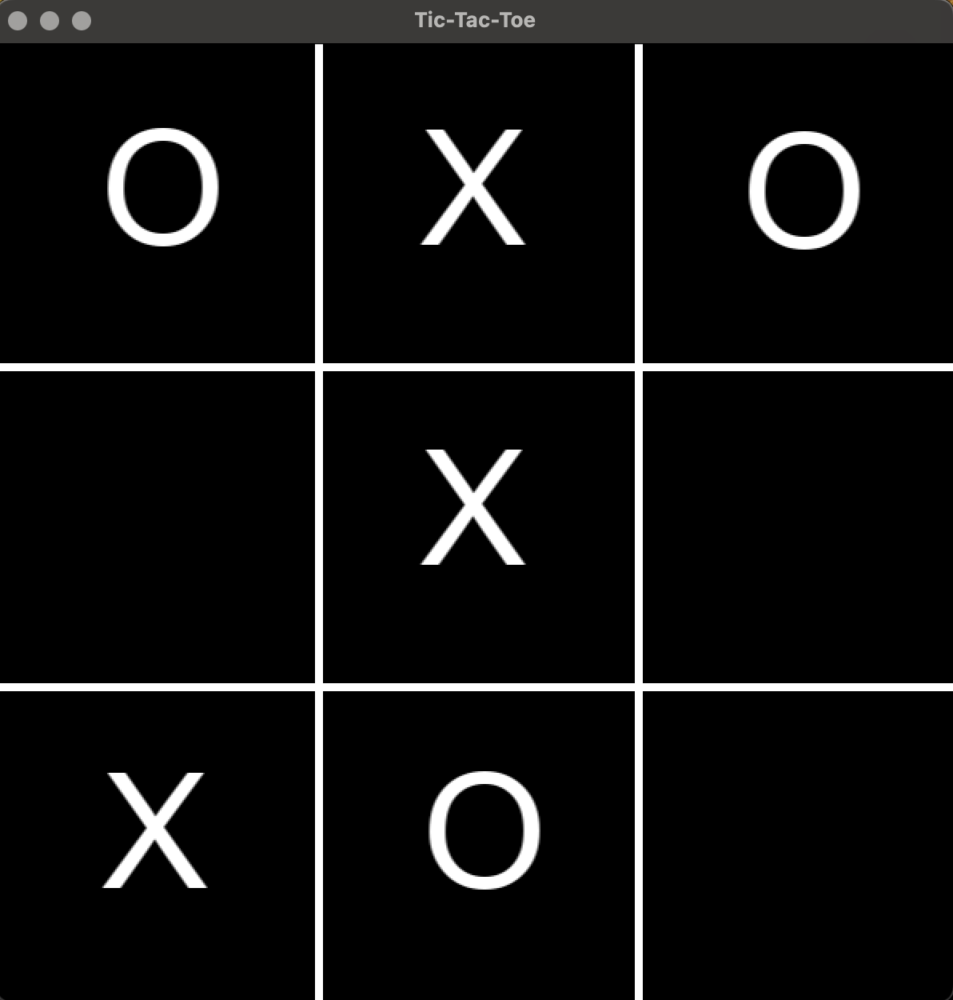
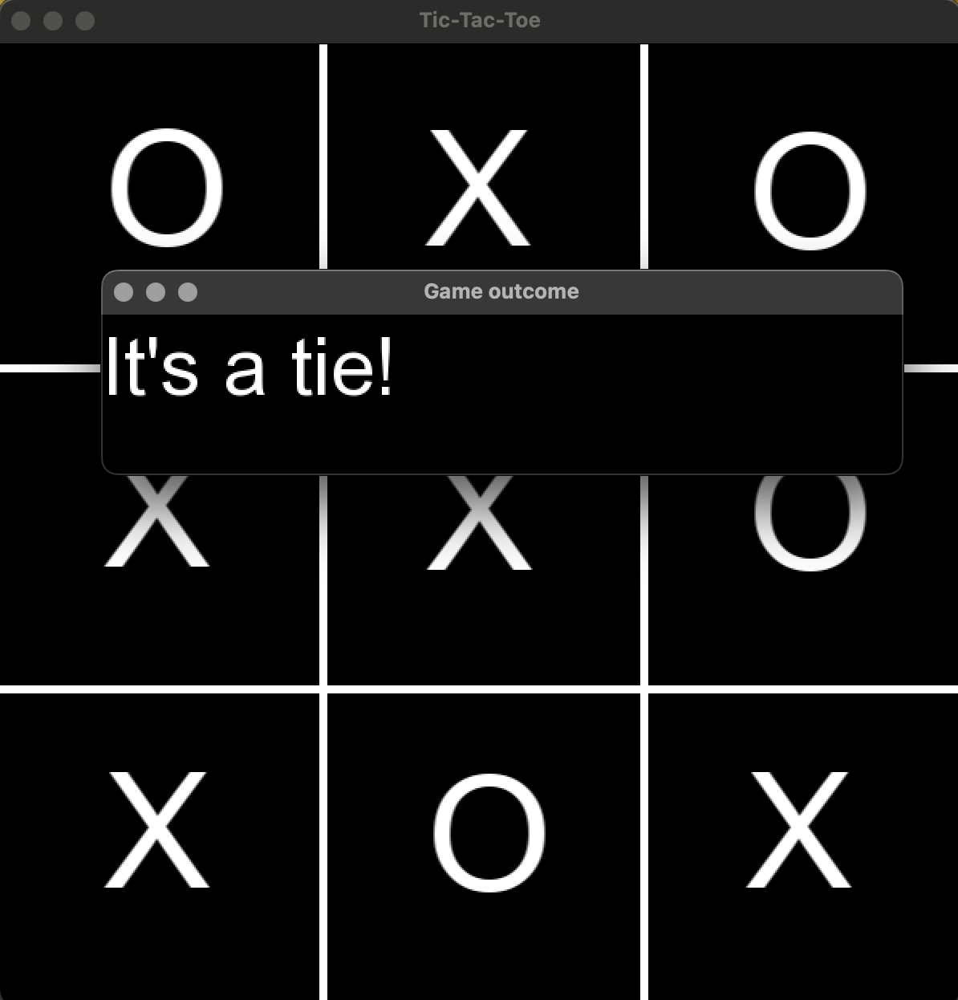

# Tic-Tac-Toe-with-Minimax-AI
A classic Tic-Tac-Toe game implemented in C++ using SFML. The opponent uses the Minimax algorithm to decide its next move.

Technologies used:
- C++,
- SFML (Simple and Fast Multimedia Library),
- Minimax algorithm with depth-based scoring.

How it works:
The AI uses the Minimax algorithm to evaluate all possible moves and choose the optimal one. The algorithm:
- Assigns scores to game states (+10 for AI win, -10 for player win, 0 for tie).
- Recursively explores all possible moves.
- Uses depth to prefer faster wins/longer losses.

## Screenshots 

  
  

